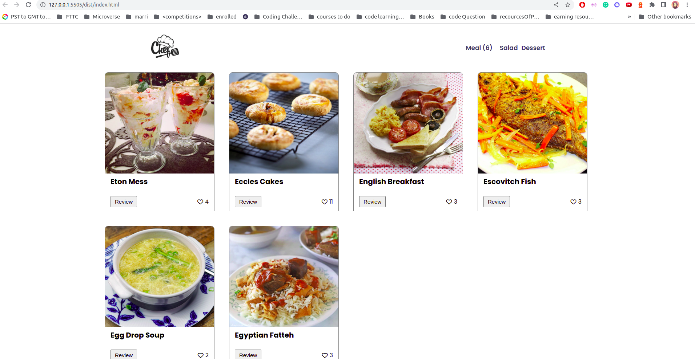
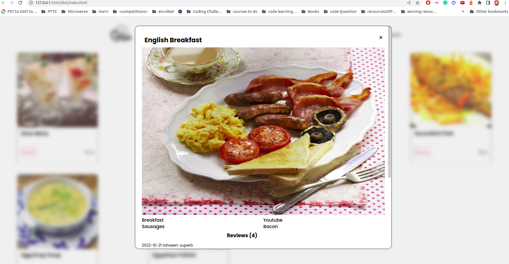
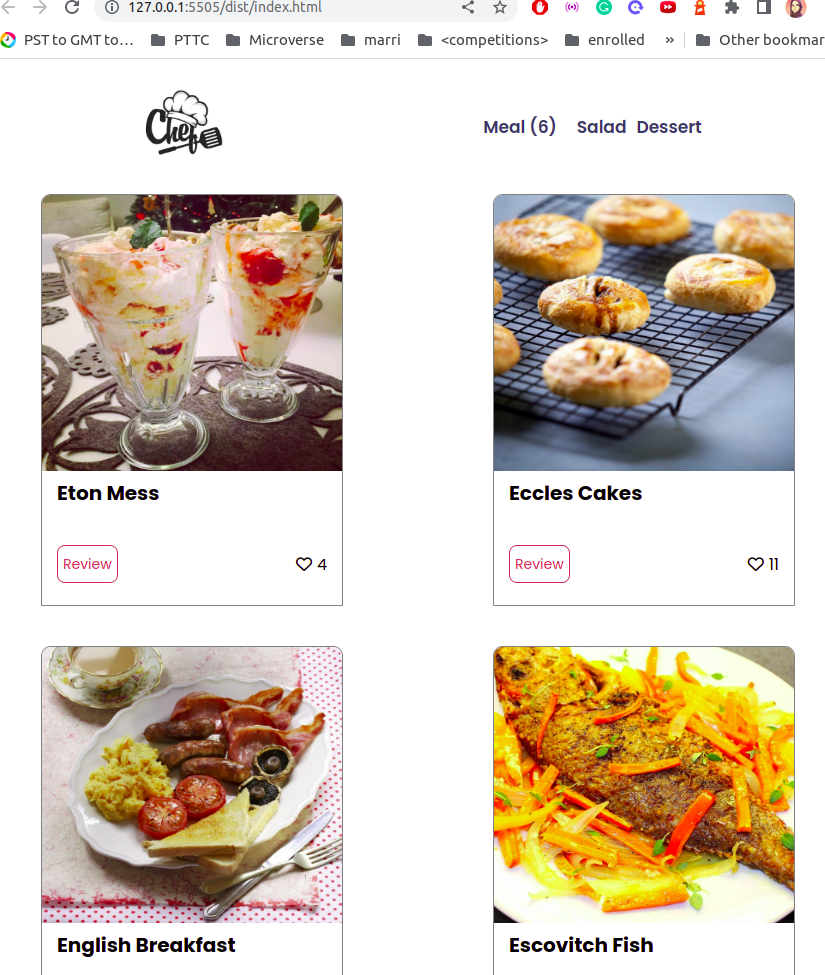

# Capstone-Module2
This project is created as the final project for Module 2 of microverse and is based on webapp that takes up the data from the API and displays it along with counters for number of likes and reviews.

## Built With

- Web Development
- HTML5, CSS3, JS
- API
- Unit test

## Project Name

Chef - A web based app that contains the food items and each card have the option for the review and likes to get the comments of the client.

## Workflow screen

- Desktop View of home page

- Popup View of home page

- Mobile view of About page

## Video Presentation

[Click here to view]()

## Live Demo

[Click here to view](not available)

## Getting Started

Fork / Clone the repository to use it on your local system.

## Usage

View the file through the source code.

## Authors

👤 **Tahseen Zahra**

- GitHub: [@tahseenzahra](https://github.com/tahseenzahra)
- Twitter: [@tahseen1zahra](https://twitter.com/tahseen1zahra)
- LinkedIn: [@tahseenzahra](https://www.linkedin.com/in/tahseenzahra/)

👤 **Joel Kugonza**

- GitHub: [@joelkugonza](https://github.com/Joel-100)
- Twitter: [@joelkugonza](https://twitter.com/JoelKugonza)
- LinkedIn: [@joelkugonza](https://www.linkedin.com/in/joel-kugonza-879211190/)

## 🤝 Contributing

Contributions, issues, and feature requests are welcome!

Feel free to check the [issues page](https://github.com/tahseenzahra/Capstone-Module2/issues).

## Show your support

Give a ⭐️ if you like this project!